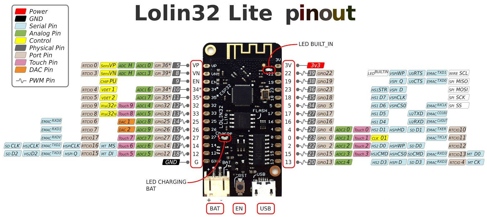
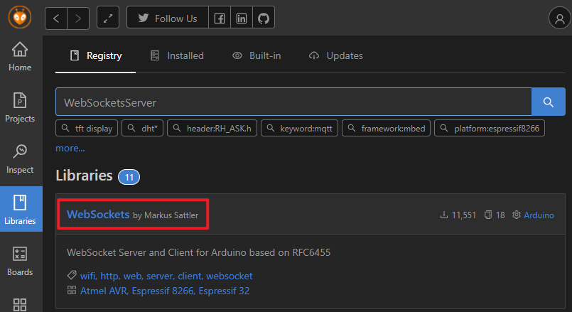

# esp32_mlx90640_uart_tx

## Environment

* PlatformIO
* WEMOS LOLIN32 Lite

## Pinout

* I2C
    * GPIO 19 = SDA
    * GPIO 23 = SCL
* Uart
    * GPIO 17 = Tx
    * GPIO 16 = Rx

## Use library

* WebSockets by Markus Sattler v2.3.6

* MLX90640 library reference
    * [thermal_cam ](https://github.com/NIU-Rebit/thermal_cam) by NIU-Rebit
    * [SparkFun_MLX90640_Arduino_Example](https://github.com/sparkfun/SparkFun_MLX90640_Arduino_Example) by sparkfun
    * [mlx90640-library](https://github.com/melexis/mlx90640-library) by melexis
